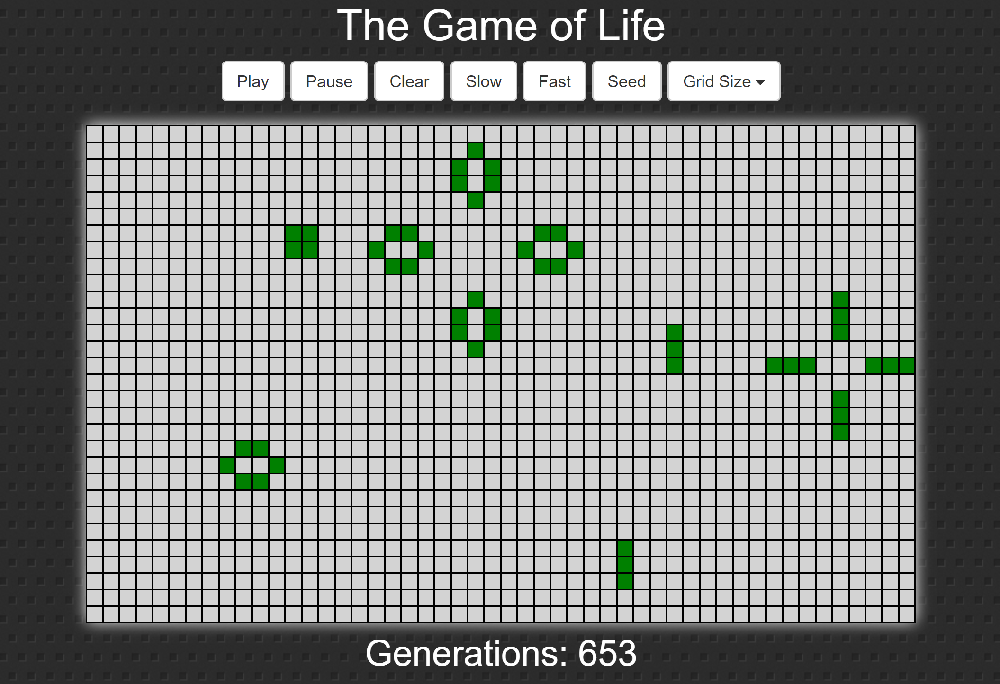
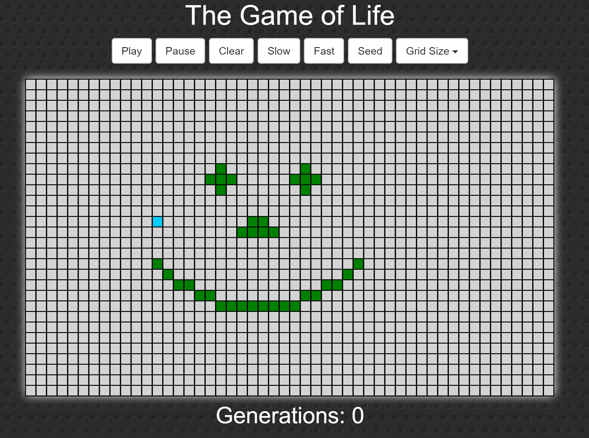

### Conway's Game of Life

 This project was bootstrapped with [Create React App](https://github.com/facebookincubator/create-react-app). Based on a tutorial by tutorial by [Freecodecamp](https://www.youtube.com/watch?v=PM0_Er3SvFQ).

You can find the most recent version of this guide [here](https://github.com/facebookincubator/create-react-app/blob/master/packages/react-scripts/template/README.md).

This project is based on the cellular automaton devised by the British mathematician John Horton Conway in 1970 which is called the [Game of Life](https://en.wikipedia.org/wiki/Conway%27s_Game_of_Life). The "game" is a zero-player game, meaning that its evolution is determined by its initial state, requiring no further input. 

## To run the app

- Please clone this repository 
- Install all npm dependencies with `$ npm install`
- Run with `$ npm start`
- A new window shoul open in your browser at `http://localhost:3000/`

## Instructions

The game will start automatically at loading time. However by clicking the ***pause*** button you may stop and use ***seed*** to start with a random configuration.

You may also try your own patterns by clicking indvidual squares.

Finally you may change the grid size and execute fast or slow iterations.

## Author

[Simon Garmendia](https://github.com/sgarmendia)

   
 